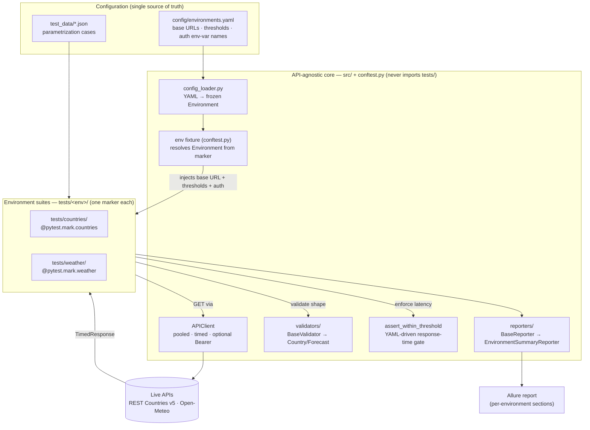

# api-validator

[](https://github.com/FiveFang/api-validator/actions/workflows/ci.yml)

📊 **Live Allure report:** https://fivefang.github.io/api-validator/
(published to GitHub Pages on every push to `main`, with accumulating trend history)

To view Allure report for any other branch use the branch name like <<https://fivefang.github.io/api-validator/preview/feature-branch-name/>>
https://fivefang.github.io/api-validator/preview/add-new-api/

A multi-environment, **YAML-driven** API consistency test framework. The same
API-agnostic infrastructure (HTTP client, validators, response-time gate,
reporting) runs against two independent "environments":

| Environment | API | Auth |
| --- | --- | --- |
| `countries` | [REST Countries v5](https://restcountries.com) | Bearer token (free tier) |
| `weather` | [Open-Meteo](https://open-meteo.com) `forecast` | none |

Environment configuration — base URLs and quality-gate thresholds — lives
entirely in `config/environments.yaml`. Test code is environment-agnostic and
never hardcodes URLs or thresholds.

## Layout
```
config/environments.yaml     # base URLs + thresholds (single source of truth)
test_data/cities.json        # parametrization data for the weather suite
src/
  config_loader.py           # YAML -> immutable Environment objects
  client.py                  # APIClient (pooled, timed, optional Bearer auth)
  validators/                # BaseValidator + Country/Forecast validators
  reporters/base.py          # BaseReporter contract
conftest.py                  # --env flag, env fixture, response-time gate
tests/countries/, tests/weather/
.claude/rules/, .claude/skills/   # Claude Code project rules & skills
.claude/commands/                 # /pa-* slash commands (onboard, generate, run)
.github/workflows/ci.yml     # CI: run suite, enforce gate, upload Allure report
```

## Setup
```bash
python -m venv .venv && source .venv/bin/activate
pip install -r requirements.txt
```

### REST Countries v5 token (for the `countries` suite)
REST Countries retired its free, no-auth v3.1 API; v5 requires a Bearer token
(free tier: 500 requests/month, no card) on the `api.restcountries.com` host.
Create a key, then either export it or drop it in a gitignored `.env`:
```bash
export RESTCOUNTRIES_API_KEY="your_v5_key"
# or:  echo 'RESTCOUNTRIES_API_KEY=your_v5_key' > .env  && set -a; . ./.env; set +a
```
If the token is **not** set, the countries suite is **skipped** (not failed), so
the pipeline stays green. The weather suite needs no auth.

v5 differs from v3.1: responses are wrapped in `{"data": {"objects": [...]}}`,
collections paginate via an `offset` query param (25/page), and endpoints are
`names.common/{name}`, `region/{region}`, and the base path for "all". Fields
were renamed (`name`→`names`, `capital`→`capitals`, and `currencies`/`languages`
are now lists) — the validator and tests are calibrated to this shape.

## Running tests
```bash
pytest                  # all environments (default; same as --env all)
pytest --env weather    # weather only
pytest --env countries  # countries only (requires RESTCOUNTRIES_API_KEY)
```

> **In Claude Code:** `/pa-run-tests [env]` runs the suite (handling `.env` token
> sourcing for `countries`), then builds a self-contained Allure report and opens
> it locally. It's a developer convenience and never runs in CI. See
> [Claude Code commands](#claude-code-commands).

### Allure report (per-environment sections)
```bash
pytest --alluredir=allure-results
allure serve allure-results          # requires the Allure CLI
```
Each test is grouped under its environment (`countries` / `weather`) via an
Allure *parent suite* label, so the report has a clear section per environment.

The latest report is published automatically to GitHub Pages:
**https://fivefang.github.io/api-validator/**

#### Per-branch report previews
CI publishes a separate report for every branch it builds:
- **`main`** → the site root: **https://fivefang.github.io/api-validator/**
- **any other branch** → a preview folder at
  `https://fivefang.github.io/api-validator/preview/<branch-name>/`

So a push to a branch named `add-new-api` is browsable at
**https://fivefang.github.io/api-validator/preview/add-new-api/**. Previews and
the root report coexist (`keep_files: true`), so a branch build never clobbers
the canonical `main` report or another branch's preview — each publish only
overwrites its own subtree. Only the `main` report accumulates trend history.

## Interpreting results
- **Passed** — endpoint returned the expected status, the response matched the
  validator's schema/range contract, and the request completed within the
  `max_response_time` threshold for that environment.
- **Failed** — a schema/type/range violation, an unexpected status, **or** a
  response-time breach of the YAML threshold (the quality gate). Any failure
  fails the CI pipeline.
- **Skipped** — the environment requires a token that isn't configured (e.g.
  `RESTCOUNTRIES_API_KEY`).

## How it works



- **Environment abstraction.** `config_loader.py` parses YAML into frozen
  `Environment` objects. The top-level `conftest.py` `env` fixture resolves each
  test's environment from its `@pytest.mark.<env>` marker and injects base URL +
  thresholds + auth. The `--env` flag selects suites by deselecting non-matching
  markers in `pytest_collection_modifyitems`.
- **Reuse across APIs.** Both suites share one `APIClient`, one `BaseValidator`
  hierarchy, and one `assert_within_threshold` gate. Adding an API = config entry
  + a validator + a test suite; the core is untouched.
- **Quality gate.** `assert_within_threshold` reads `max_response_time` from the
  environment, so the gate is YAML-driven, never hardcoded. The client pools and
  warms connections per environment so the gate measures steady-state API
  latency, not one-off DNS/TLS setup.
- **Reporting.** Allure is primary (per-environment sections). Alongside it, a
  concrete `BaseReporter` — `EnvironmentSummaryReporter` (`src/reporters/summary.py`)
  — is wired in `conftest.py` to print a per-environment passed/failed/skipped
  summary to the terminal and CI job output. Custom summaries plug in by
  extending `BaseReporter`.

## Adding a new API / environment
The framework is environment-count-agnostic: the set of environments is derived
from config, so onboarding a third (or fourth…) API touches **only** new files —
the core (`conftest.py`, `client.py`, base classes) stays untouched. Say you want
to add a `posts` environment for `https://api.example.com/v1`:

1. **Declare it in `config/environments.yaml`** — add an entry under
   `environments:` with `base_url`, `max_response_time`, `min_results_count`, and
   (only if the API needs a Bearer token) `auth_token_env: POSTS_API_KEY`:
   ```yaml
     posts:
       base_url: https://api.example.com/v1
       max_response_time: 2.5
       min_results_count: 1
   ```
   This alone makes `--env posts` a valid choice and registers the `posts`
   marker — no change to the selection machinery.

2. **Add a validator** in `src/validators/posts.py` extending `BaseValidator`
   (declare `required_fields` / `field_types`, override `validate_custom` for
   business rules). The `.claude/skills/validator-generator` skill can scaffold
   this from a sample JSON response.

3. **Add a test suite** under `tests/posts/test_posts.py`. Every test must:
   - carry `@pytest.mark.posts`,
   - use the shared `api_client`, `env`, and `assert_within_threshold` fixtures
     (never hardcode URLs/thresholds or call `requests` directly),
   - delegate schema checks to your validator, and
   - parametrize any data-driven cases from `test_data/*.json`.
   The `.claude/skills/test-generator` skill scaffolds a compliant file.

4. **(If authenticated) provide the token** — set the env var named by
   `auth_token_env` locally (e.g. in `.env`) and add a matching repository
   secret for CI. Without it, that environment's tests skip (CI stays green).

That's everything. `pytest` (or `--env all`) now runs the new suite alongside
the others, `--env posts` runs just it, the response-time gate and Allure
per-environment section apply automatically, and CI picks it up with no workflow
change. See `.claude/rules/framework-rules.md` for the binding constraints.

> **Step 1 wires the plumbing only.** Adding the YAML entry makes `--env <name>`
> valid and registers the marker, but until a marked test suite exists,
> `pytest --env <name>` collects **zero tests**. Steps 2–3 (validator + tests)
> encode your specific API and are still required — the framework can't synthesize
> them at runtime.

### Generating the validator + tests with Claude
Steps 2–3 are exactly what the `.claude/skills/` automate. Add the config entry
(step 1), then ask Claude in plain language — it invokes `validator-generator`
and `test-generator`, follows `.claude/rules/`, runs the suite, and iterates
until green. You can also invoke the skills directly: `/validator-generator`,
`/test-generator`.

**One-step path:** run **`/pa-add-api`** to do all of steps 1–3 (and the run +
log) in one guided command, or **`/pa-generate-tests`** to (re)generate just the
validator + suite for an environment. See
[Claude Code commands](#claude-code-commands).

A one-shot prompt looks like:

> "I added a `posts` env (`https://api.example.com/v1`) to `config/environments.yaml`.
> Generate a validator + pytest suite and run it:
> - `GET /posts` → assert more than 0 results
> - `GET /posts/1` → validate fields `id, title, body, userId` present and typed
> - sample response: `{ "id": 1, "title": "...", "body": "...", "userId": 1 }`
> Then run `pytest --env posts` and show the results."

What makes it one-shot (include as much as you can):
- the **env name** (must match the YAML key);
- **endpoints + methods** to test;
- **fields / schema** to validate — or just paste a **sample JSON response**
  (best; types are inferred from it);
- any **specific rules** (min counts, value ranges, cross-references);
- if the API needs **auth**, just say so — Claude reads the token from
  `.env`/config (don't paste the key).

Shortcut for a public API: say *"the API is public, probe it yourself to learn
the shape"* and Claude will hit a few endpoints to discover the response
structure before generating (as was done for REST Countries v5 and Open-Meteo).

## Claude Code commands
Three project slash commands live in `.claude/commands/` and wrap the rules +
skills into one-step workflows. All are namespaced with a `pa-` prefix
(*p*roject *a*pi-validator) to keep them distinct from built-ins:

| Command | What it does |
| --- | --- |
| `/pa-add-api [name]` | Onboard a new API as a new environment end to end: gather details (or probe a public API), confirm, add the `config/environments.yaml` entry, generate the validator + test suite, run them green, and log it. |
| `/pa-generate-tests [env]` | (Re)generate the validator + suite for an environment. If the env isn't declared in config yet, it offers to add it first and circles back — so it never produces a zero-test suite. |
| `/pa-run-tests [env]` | Run the suite for one env (or `all`), sourcing `.env` for `countries`, then build a self-contained Allure report and open it locally. Read-only. |

These are **developer conveniences invoked in Claude Code** and never run in CI;
they only orchestrate the same skills, rules, and `pytest`/Allure flow documented
above. The `/pa-*` markdown files are the source of truth for each command.

## CI
`.github/workflows/ci.yml` triggers on push to any branch (and PRs): sets up
Python, installs dependencies, runs the full suite, **fails on any test failure
or quality-gate breach**, prints a test summary to the job output, and uploads
the Allure report (and JUnit XML) as artifacts. It also publishes the HTML
report to GitHub Pages — `main` to the site root, other branches to
`preview/<branch>/` (see [Per-branch report previews](#per-branch-report-previews)).
Set a `RESTCOUNTRIES_API_KEY` repository secret to enable the countries suite in CI.

### Managing the `RESTCOUNTRIES_API_KEY` CI secret (GitHub CLI)
The workflow reads `${{ secrets.RESTCOUNTRIES_API_KEY }}`. Manage it with `gh`
(authenticate first with `gh auth login`):

```bash
# Add or update the secret (interactive prompt — value is not echoed/stored in shell history)
gh secret set RESTCOUNTRIES_API_KEY --repo FiveFang/api-validator

# Set it non-interactively from your local .env (or any source), avoiding shell history
gh secret set RESTCOUNTRIES_API_KEY --repo FiveFang/api-validator --body "$RESTCOUNTRIES_API_KEY"

# List configured secrets (names and update times only — values are never shown)
gh secret list --repo FiveFang/api-validator

# Delete the secret (countries tests then SKIP in CI instead of failing)
gh secret delete RESTCOUNTRIES_API_KEY --repo FiveFang/api-validator
```

Notes:
- `gh secret set` both **creates and updates** — re-running it rotates the value.
- Secret **values are write-only**: GitHub never lets you read them back, so
  there is no "get" command — only set/list/delete.
- Omit `--repo <owner>/<name>` to target the repository in the current directory.
- Deleting the secret is the quick way to make CI green when the key is
  unavailable (e.g. frozen/quota-exhausted): countries skip rather than fail.

## Design decisions & assumptions
- **"Zero hardcoded values"** is interpreted as *environment/config* values
  (base URLs, response-time and result-count thresholds) living only in YAML.
  Values intrinsic to a specific assertion (Europe has > 40 countries;
  temperature is physically within −80..60 °C; hourly entries > 0) are kept as
  named, commented constants in the test/validator — they are properties of the
  data under test, not deployment config.
- **REST Countries v5 + token.** The assignment named v3.1 as "free, no auth",
  but that API is now deprecated and returns a stub. v5 (token-gated, on
  `api.restcountries.com`) is used instead; the framework is token-driven and
  skips gracefully without a key. The validator and tests are calibrated to the
  v5 response shape (wrapped `data.objects`, `offset` pagination, renamed
  fields). Note v5 includes uninhabited territories (e.g. Bouvet Island) with
  population 0, so the "/all" test asserts a positive population only for
  countries that have a capital.
- **Open-Meteo** returns grid-snapped coordinates and resolves `timezone=auto`
  to a real IANA name; tests allow a 1° coordinate tolerance accordingly.
- **`/pa-*` commands wrap, never replace.** The slash commands in
  `.claude/commands/` are thin orchestration over the existing rules, skills, and
  `pytest`/Allure flow — they add no test logic or framework behaviour and run
  only inside Claude Code, so CI and a plain `pytest` invocation are unaffected.
  The `pa-` prefix namespaces them away from Claude Code built-ins.
- **Test status philosophy.** The `--env` flag *deselects* the non-matching
  environment's tests during collection (via `pytest_deselected` in
  `conftest.py`), so a targeted run reports e.g. `10 passed, 4 deselected` —
  deselected tests are excluded from the run rather than executed-and-skipped.
  `Skipped` is reserved for a distinct case: an environment that requires an
  auth token (e.g. `countries` without `RESTCOUNTRIES_API_KEY`) is skipped at
  runtime so CI stays green. Both are intentional and non-failing; the default
  `pytest` run (no `--env`) executes every environment.
